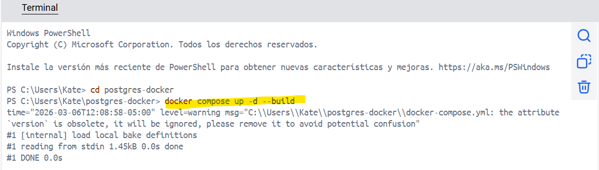
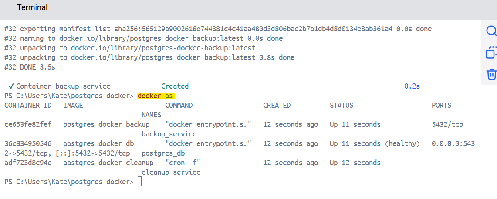
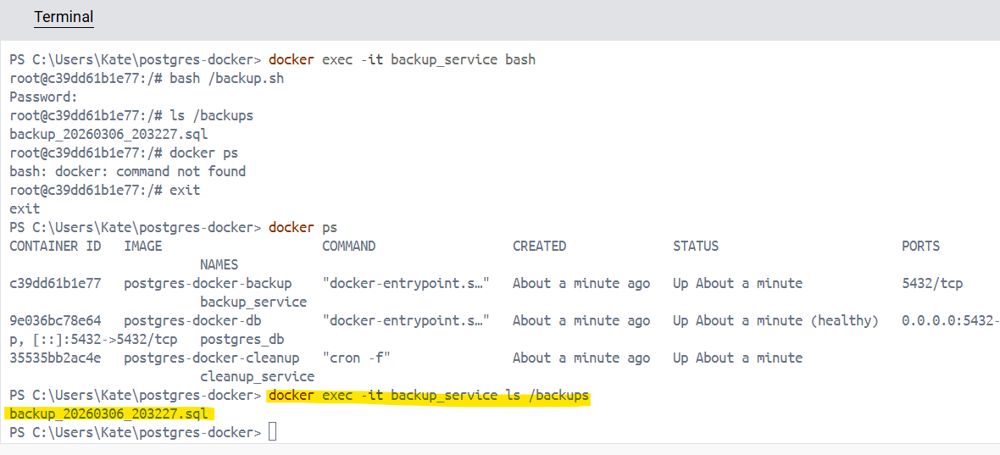
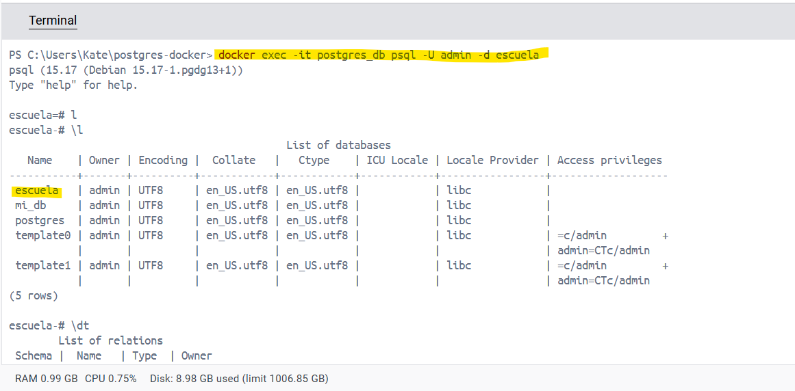
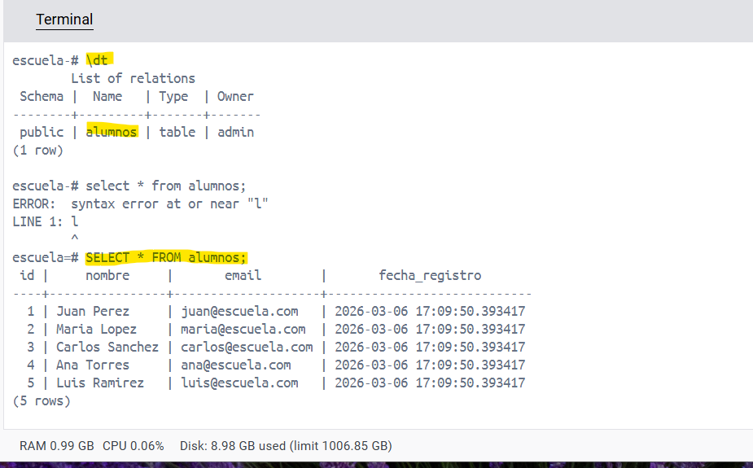

# PostgreSQL Containerizado con Backups Automáticos

Este proyecto implementa un entorno completamente containerizado usando Docker y Docker Compose basado en PostgreSQL.

## Características

El sistema está compuesto por 3 contenedores:

postgres_db

- Base de datos PostgreSQL
- Inicializa la BD usando init.sql

backup_service

 - Ejecuta pg_dump
 - Genera backups cada 2 horas

cleanup_service

 - Elimina backups antiguos
 - Mantiene solo el backup más reciente

## Tecnologías utilizadas

- Docker
- Docker Compose
- PostgreSQL
- Bash
- Cron

### PostgreSQL
- Imagen custom creada mediante Dockerfile
- Inicialización automática mediante init.sql

### Backup Service
- Ejecuta pg_dump cada 2 horas
- Guarda backups en volumen persistente
- Formato: backup_YYYYMMDD_HHMMSS.sql

### Cleanup Service
- Elimina backups antiguos cada 4 horas, manteniendo solo el más reciente.

## Volúmenes

- postgres_data → datos de PostgreSQL
- backups → almacenamiento de backups

## Red

Red personalizada tipo bridge llamada:

postgres_network

## Ejecución

```bash
docker-compose up --build
```


```bash
docker ps
```


```bash
docker exec -it backup_service ls /backups
```


```bash
docker exec -it postgres_db psql -U admin -d escuela
```


